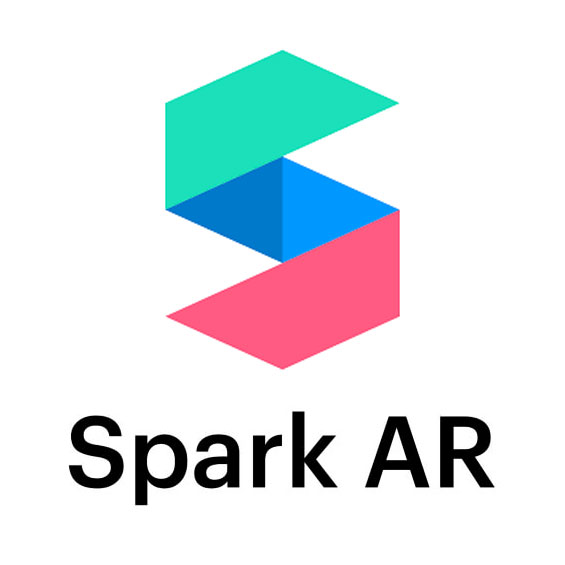

# SparkAR Studio
Spark AR lets your business create and share augmented reality experiences that reach the billions of people using Facebook, Messenger and Instagram.

# Getting Started with AR/VR

## Augmented Reality(AR)
Augmented Reality is an interactive experience of a real-world environment where the objects that reside in the real world are enhanced by computer-generated perceptual information.

## Virtual Reality(VR)
Virtual Reality is a simulated experience that can be similar to or completely different from the real world. The applications of virtual reality include entertainment (video games), education (medical or military training) and business (virtual meetings).

## Mixed Reality
Mixed Reality is the merging of real and virtual worlds to produce new environments and visualizations, where physical and digital objects co-exist and interact in real time.

## Extended Reality 
Extended Reality  is a concept referring to all real-and-virtual combined environments and human-machine interactions generated by computer technology and wearables. Including augmented reality (AR), mixed reality (MR) and virtual reality (VR).

# Step by Step Process to Buld 3 Instagram Filters

### 1. 3D Object Interaction in Augmented Reality 
We will explore 3D object interaction with the real world by creating a 3D animated object and placing it in the real-world environment.

### 2. Interaction with the Real-World Environment through our Camera Lenses 
In this filter, we will craft a SNOW effect and equip it with the ability to be controlled by tapping on the screen.

### 3. Modifying the Background
Utilizing 5 distinct UI pickers, we will alter the background to create 5 unique variations and include a button for easy access by clicking.

# Download SparkAR Studio here:
https://sparkar.facebook.com/ar-studio/download/

# Learning Resources

* [Official Resources by Meta for Spark AR studio](https://sparkar.facebook.com/ar-studio/learn/)

* [Spark AR Community Repo](https://github.com/Spark-AR-Community)

* [Scripting Reference](https://sparkar-community.gitbook.io/docs/)

* [Spark AR extensions](https://sparkar-community.gitbook.io/docs/)\

* [Spark AR Reddit Community](https://www.reddit.com/r/SparkArStudio/)